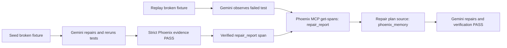

# Phoenix Repair-Memory Replay Design

## Purpose

TracePilot already proves that Gemini can repair a broken checkout service while
consulting Phoenix MCP evidence. Issue #90 adds the stronger Arize proof: a
verified repair is recorded as reusable operational memory, and a later repair
session consumes that recorded outcome through Phoenix MCP.

## Scope

This feature adds one video-ready two-run path:

1. Seed run: Gemini repairs the broken checkout fixture and the runner verifies
   the expected minimal patch and passing retry.
2. Outcome recording: after strict verification, the runner emits a sanitized
   `gemini_cli.chain.repair_report` span with the failure signature, selected
   strategy, repair fingerprint, and `verification_passed=true`.
3. Replay run: Gemini receives the same observable failure class in a fresh
   disposable workspace.
4. Memory proof: Phoenix MCP returns the verified report from the seed run; run
   two's `gemini_cli.chain.repair_plan` records a Phoenix-memory candidate that
   identifies the seed session.

The existing single-run command remains valid. The new command composes two
strict runs and prints only concise proof lines suitable for a recording.

## Components

- `scripts/demo-gemini-repair-agent.ts` records a verified repair outcome only
  after real-agent local repair and strict Phoenix evidence have passed.
- `packages/core/src/telemetry/phoenixSelfIntrospection.ts` limits historical
  memory lookup to verified repair-report spans. Planning spans are not valid
  learning outcomes because they are emitted before verification.
- `scripts/demo-phoenix-repair-memory-replay.ts` runs seed/replay sessions,
  queries the replay plan through Phoenix MCP, and writes a sanitized combined
  report.
- Script and core tests verify redacted report production, narrowed memory
  querying, seed-session matching, and degraded/offline behavior.

## Data Flow

## Safety And Truthfulness

- No raw environment key or raw bearer value is written to reports or output.
- A historical-memory PASS requires a verified report from the seed session to
  appear in the replay repair-plan telemetry; an MCP query attempt alone is not
  enough.
- The seed outcome span is emitted only after strict real-agent verification,
  not by the deterministic offline substitute.
- Failure and quota paths remain explicit FAIL/DEGRADED output rather than
  claiming memory use.

## Verification

- Red-green core test for querying only `repair_report` memory spans.
- Red-green script test for concise replay proof/report sanitization.
- Existing single-run strict and offline demos remain green.
- Live two-run command must print: `SEED_REPAIR`, `VERIFIED_REPAIR_RECORDED`,
  `REPLAY_REPAIR`, `PHOENIX_MEMORY_MATCH`, `REPLAY_RETRY_TEST`, and `EVALS`.

## Deferred Work

Observed destructive-command safety proof, quota backoff, and LLM-as-a-Judge
remain separate issues #91, #92, and #93.
